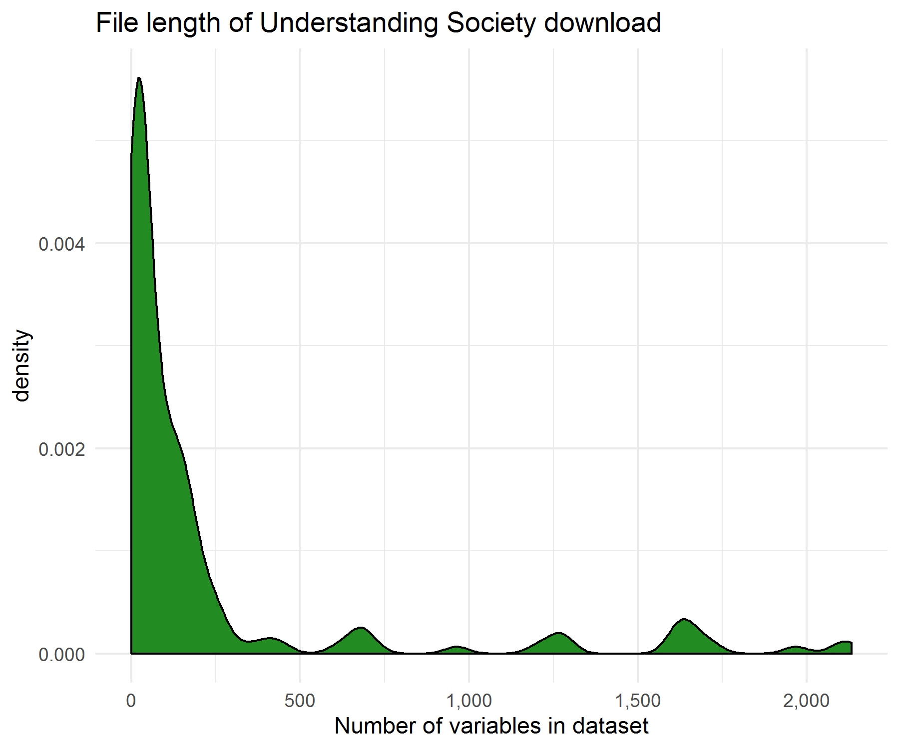
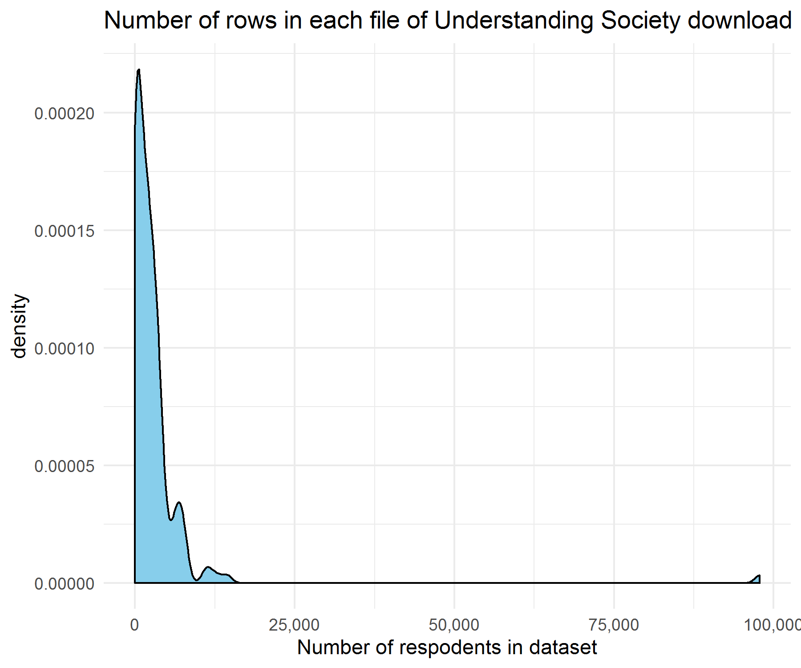
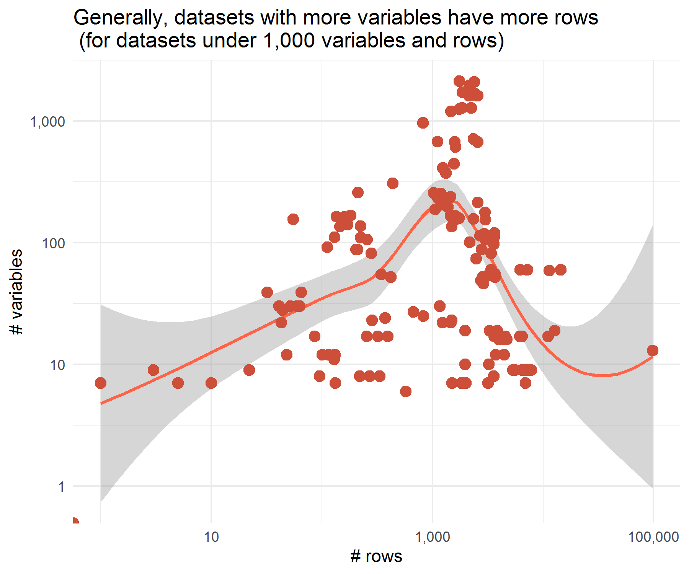

# UK Understanding Society with R & the Tidyverse
*General R code for working with the UK Understanding Society database. *

## Overview
The UK Understanding Society is a panel study of people living in the UK that has been running since the 1990's. The bulk download is a large and complicated set of files. This repository provides an overview of how to parse the files and create some useful dictionaries and lookup files using the R programming language. Specifically, it uses the `tidyverse` approach.

This repo contains scritps to help you 

1. Batch code  and parse files on variables and data
2. Create a data dictionary file
3. Create a data lookup file

## Who could use this?

The Understanding Society database bulk download can be found [here](https://beta.ukdataservice.ac.uk/datacatalogue/series/series?id=2000053). It's a large set of files, and data is spread out. It can be difficult to make sense of what's all there. 

### How big? REAL big!

There are about 160 tab-delimated files in the download. Some datasets have over 2,000 variables.
 
 
 
 
 
 
 
 

Some datasets have close to 100,000 rows.
 
 
 
 
 
 
 

This repo can help with that

